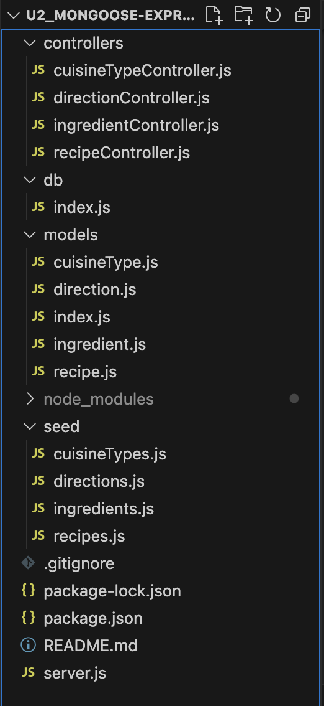

# Mongoose & Express Setup

## File Hierarchy

### What do these do?

1. db
    1. Allows the Javascript to connect to the MongoDB database
2. Models
    1. Creates schemas for each collection inside of your database.
    2. The index.js file is the default go to. Your code will reference it for imports
3. Seed
    1. File for populating your database
4. Server.js
    1. The code for each path and what will the paths do
5. Controllers
    1. What the actions are for each path. 



## Imports and Node.js

```bash
npm init -y
npm i mongoose express cors body-parser morgan
npm i nodemon --save-dev
```

<aside>
💡 MAKE SURE TO START A .gitignore FILE BEFORE DOING ANYTHING WITH GIT

</aside>

```bash
/node_modules
.DS_Store
```

Now, you have to set up `nodemon` in the package.json file.

```json
"scripts": {
    "test": "echo \"Error: no test specified\" && exit 1",
    "start": "node server.js",
    "dev": "nodemon server.js"
},
```

Now, to run your code, you only need to type:

```bash
npm run dev
```

### Set up your file hierarchy

```bash
mkdir db client models seed controllers
touch db/index.js client/{index.html,style.css,script.js} models/{modelName,index}.js seed/{modelName}.js
```

## Inside of your db/index.js

```jsx
const mongoose = require('mongoose')

mongoose
    .connect(`mongodb://127.0.0.1:27017/${YOUR DATABASE NAME}`)
    .then(() => {
        console.log('Successfully connected to MongoDB.')
    })
    .catch(e => {
        console.error('Connection error', e.message)
    })
mongoose.set({debug: true}) //returns console.logs when it does something

const db = mongoose.connection

module.exports = db
```

## Inside of you models folder

### For Each of Your Collections

```jsx
const { Schema } = require('mongoose')

const Collection = new Schema(
    {
        key: { type: type, required: true }
    },
    { timestamps: true },
)

module.exports = Collection
```

### Inside of your index.js File

```jsx
const mongoose = require('mongoose')
const collection1schema = require('./collection1')
const collection2schema = require('./collection2')

const Collection1 = mongoose.model('Collection1', collection1Schema, `${CollectionName}`)
const Collection2 = mongoose.model('Collection2', collection2Schema, `${CollectionName}`)

module.exports = {
    Collection1,
    Collection2,
}
```

## Inside of your seed files

```jsx
const db = require('../db')
const { Collection1 } = require('../models')

db.on('error', console.error.bind(console, "MongoDB connection error: "))

const main = async () => {
    const entries = [
        {
            key: "Value",
        }
    ]

    await Collection1.insertMany(entries)
    console.log('Entries were inserted to database')
}

const run = async () => {
    await main()
    db.close()
}

run()
```

## Controllers

```jsx
const { Collection1 } = require('../models')

const getCollections = async (req, res) => {
    try {
        const collections = await Collection1.find()
        res.json(collections)
    } catch (error) {
        return res.status(500).send("An error has occured")
    }
}

const getCollectionById = async (req,res) => {
    try {
        const collection = await Collection.findById(req.params.id)
        if (collection) {
            res.json(collection)
        }
    } catch (error) {
        return res.status(500).send('Collection with the specified ID does not exists');
    }
}

// ... There can more. The posibilities are Endless
```

## Server.js File

```jsx
//Necessary Imports
const express = require('express');
const db = require('./db');
const logger = require('morgan');
const bodyParser = require('body-parser');
const cors = require('cors');

//Controller functions
const { getCuisineTypes, getCuisineTypeById, updateCuisineType, deleteCuisineType, createCuisineType } = require('./controllers/cuisineTypeController');
const { getDirections, getDirectionById, updateDirection, deleteDirection, createDirection } = require('./controllers/directionController');
const { getIngredients, getIngredientById, createIngredient, updateIngredient, deleteIngredient } = require('./controllers/ingredientController');
const { getRecipes, getRecipeById, createRecipe, updateRecipe, deleteRecipe } = require('./controllers/recipeController');

//Set up for Express
const PORT = process.env.PORT || 3001;
const app = express();

//middleware here
app.use(cors()) //Necessary for some HTTP methods while working on local network
app.use(bodyParser.json()) //Allows you to use the body of requests
app.use(logger('dev')) //Better logs

//Set up and homepage
app.listen(PORT, () => console.log(`Listening on port: ${PORT}`))

app.get('/', async (req,res) => {
    res.send("Welcome to my Cookbook!")
})

//Endpoints
app.get('/recipes', getRecipes)
app.post('/recipes/create', createRecipe)
app.get('/recipes/:id', getRecipeById)
app.put('/recipes/:id/update', updateRecipe)
app.delete('/recipes/:id/delete', deleteRecipe)

// Handle 404 errors
app.get('/*', async (req,res) => {
    res.send('An error has occurred. Try again later (404)')
})
```

